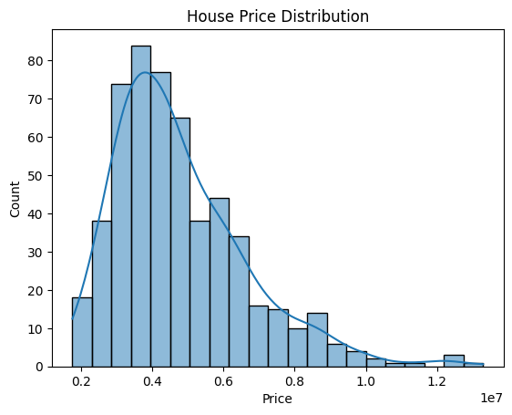
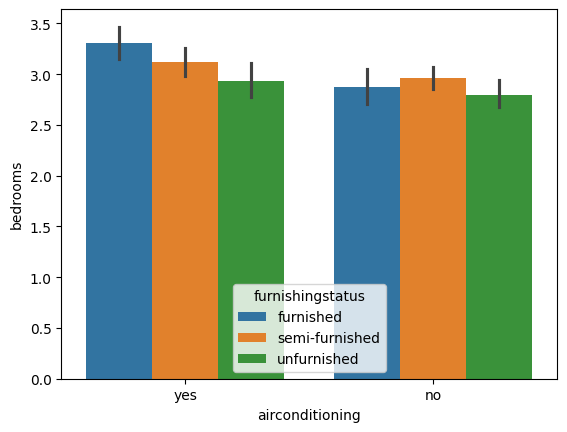
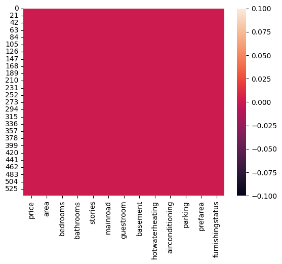
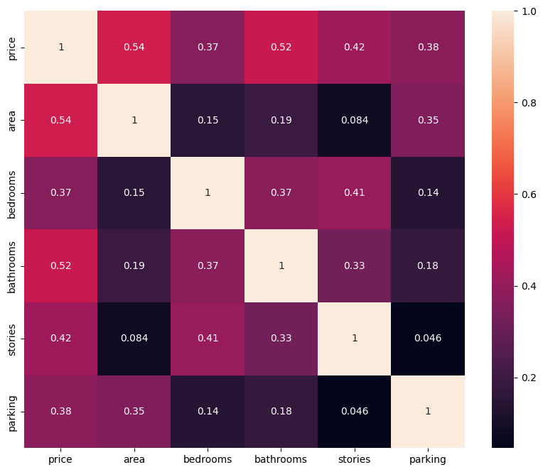
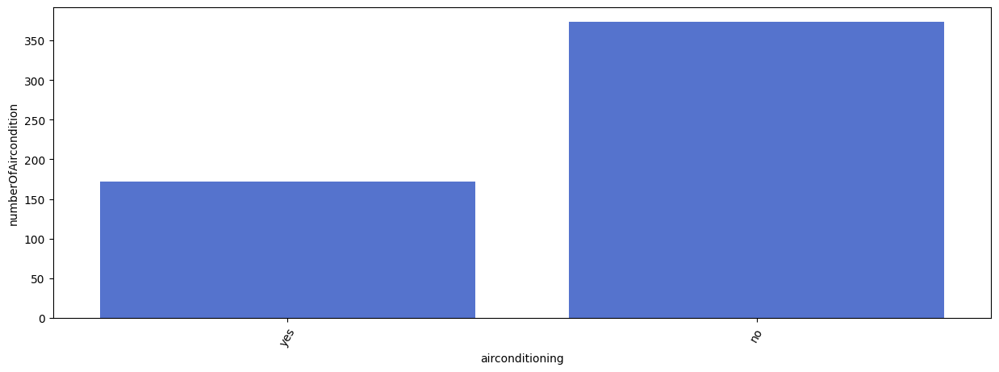
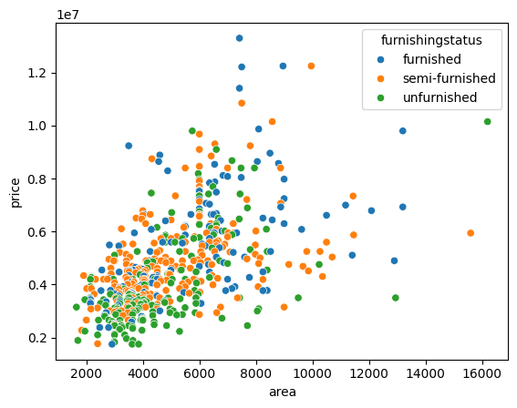
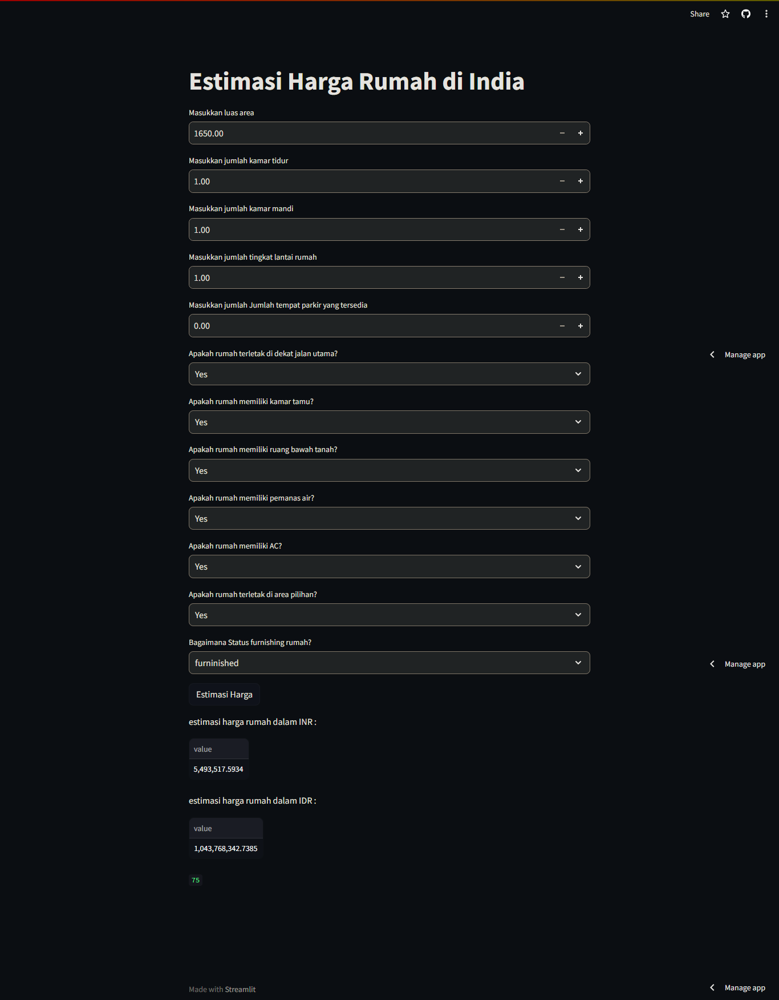

# Laporan Proyek Machine Learning

### Nama : Satrio Mukti Prayoga

### Nim : 211351137

### Kelas : Malam B

## Domain Proyek

Estimasi harga rumah ini digunakan untuk memperkirakan harga rumah yang akan di beli oleh calon pembeli rumah di india, dan harga tersebut sesuai dengan mata uang india yaitu INR, tersedia juga mata uang IDR (kurs : Rp190,75 pada 20 Oktober 2023).

## Business Understanding

### Problem Statements

- Memprediksi harga rumah di India berdasarkan berbagai faktor

### Goals

- Membangun model prediktif yang akurat untuk memprediksi harga rumah berdasarkan berbagai atribut dari dataset yang tersedia.

### Solution statements

Solution Statement 1: Menggunakan algoritma machine learning Regresi Linier untuk memprediksi harga rumah. Membandingkan performa model-model tersebut dan memilih yang terbaik berdasarkan metrik evaluasi.

Solution Statement 2: Menggunakan kurs mata uang yang berlaku untuk mengonversi harga rumah dari INR ke IDR.

## Data Understanding

Data yang digunakan dalam proyek ini berasal dari sumber [kaggle](https://www.kaggle.com/) dan berisi informasi tentang berbagai atribut rumah dan harga rumah di India.

<br>

[Housing Prices Dataset](https://www.kaggle.com/datasets/yasserh/housing-prices-dataset/).

### Variabel-variabel pada Dataset ini adalah sebagai berikut:

- price : Harga rumah dalam mata uang India (INR). (int64)
- area : Luas rumah dalam persegi kaki. (int64)
- bedrooms : Jumlah kamar tidur. (int64)
- bathrooms : Jumlah kamar mandi. (int64)
- stories : Jumlah lantai rumah. (int64)
- mainroad : Apakah rumah terletak di dekat jalan utama. (object)
- guestroom : Apakah rumah memiliki kamar tamu. (object)
- basement : Apakah rumah memiliki ruang bawah tanah. (object)
- hotwaterheating : Apakah rumah memiliki pemanas air. (object)
- airconditioning : Apakah rumah memiliki AC. (object)
- parking : Jumlah tempat parkir yang tersedia. (int64)
- prefarea : Apakah rumah terletak di area pilihan. (object)
- furnishingstatus : Status furnishing rumah. (object)

## Data Preparation

Dataset "Housing Price Dataset" didapat dari website [kaggle](https://www.kaggle.com/)

disini saya akan mengkoneksikan google colab ke kaggle menggunakan token dari akun saya :
```bash
from google.colab import files
files.upload()
```

disni saya akan membuat direktori untuk menyimpan file kaggle.json
```bash
!mkdir -p ~/.kaggle
!cp kaggle.json ~/.kaggle/
!chmod 600 ~/.kaggle/kaggle.json
!ls ~/.kaggle
```

saya akan mendownload file datasetnya dari kaggle :
```bash
!kaggle datasets download -d yasserh/housing-prices-dataset
```

disini saya mengekstrak file dari dataset yang sudah saya download :
```bash
!unzip housing-prices-dataset.zip
```

lalu saya akan membuat EDA, dengan menggunakan beberapa library, pertama saya akan import beberapa library yang akan dipakai :

```bash
import pandas as pd
import numpy as np
import matplotlib.pyplot as plt
import seaborn as sns
```

Setelah itu saya akan akan mengimport beberapa modul dari library scikit-learn (sklearn) yang akan dipakai untuk melatih model regresi linier.

```bash
from sklearn.model_selection import train_test_split
from sklearn.linear_model import LinearRegression
```

Disini saya akan memanggil dan menyimpan dataset di variabel df dengan menggunakan kode sebagai berikut :

```bash
df = pd.read_csv('Housing.csv')
```

Setelah dataset disimpan di variabel df, saya akan melihat kolom apa saja yang ada di dalam dataset

```bash
df.head()
```

Saya juga melihat list dataset paling akhir/bawah

```bash
df.tail()
```

Setelah itu saya akan mengecek apakah ada data null pada dataset yang saya gunakan ini

```bash
df.isnull().sum()
```

Saya akan mengecek distribusi harga rumah

```bash
plt.figure
sns.histplot(df['price'], kde=True)
plt.title('House Price Distribution')
plt.xlabel('Price')
plt.show()
```



Saya juga akan mengecek jumlah kasur yang tersedia, ketersediaan ac dengan 3 kondisi furnishingstatus rumah yang berbeda

```bash
sns.barplot(x=df['airconditioning'],y=df['bedrooms'],hue=df["furnishingstatus"])
```



Selanjutnya saya juga akan mengecek data null menggunakan seaborn heatmap

```bash
sns.heatmap(df.isnull())
```



Lalu disini saya akan mencoba describe beberapa kolom yang numerical

```bash
df.describe()
```

Disini saya akan membuat sebuah heatmap (peta panas) yang menunjukkan korelasi antara variabel-variabel numerik dalam dataset.

```bash
plt.figure(figsize=(10,8))
sns.heatmap(df.corr(numeric_only=True),annot=True)
```



Lalu saya akan mengecek perbandingan rumah yang memakai AC dan tidak memakai AC

```bash
ac = df.groupby('airconditioning').count()[['price']].sort_values(by='price',ascending=True).reset_index()
ac = ac.rename(columns={'price':'numberOfAircondition'})

fig = plt.figure(figsize=(15,5))
sns.barplot(x=ac['airconditioning'], y=ac['numberOfAircondition'],color='royalblue')
plt.xticks(rotation=60)
```



Saya akan memvisualisasikan hubungan antara harga rumah (y) dan luas area (x) dengan mempertimbangkan furnishing status.

```bash
sns.scatterplot(y=df['price'],x=df['area'],hue=df['furnishingstatus'])
```



## Modeling

Langkah awal yang akan saya lakukan adalah memasukkan fitur yang akan digunakan untuk mengestimasi harga rumah

```bash
features = ['area', 'bedrooms', 'bathrooms', 'stories', 'mainroad', 'guestroom', 'basement', 'hotwaterheating', 'airconditioning', 'parking', 'prefarea','furnishingstatus']

# Mengganti nilai 'yes' dan 'no' dengan True dan False
df.replace({'yes': True, 'no': False}, inplace=True)

# Menggunakan map() untuk mengubah nilai kategori menjadi numerik
encoding = {'furnished': 2, 'semi-furnished': 1, 'unfurnished': 0}
df['furnishingstatus'] = df['furnishingstatus'].map(encoding)

x = df[features]
y = df['price']
x.shape, y.shape
```

Saatnya saya memisahakan data test dan data train, disini saya menggunakan data test sebesar 20% dan random_state 50

```bash
x_train, X_test, y_train, y_test = train_test_split(x, y, test_size=0.2 ,random_state=50)
y_test.shape
```

Nah disini dilakukan proses modelling menggunakan regresi linier

```bash
lr = LinearRegression()
lr.fit(x_train,y_train)
pred = lr.predict(X_test)
```

## Evaluation

Hasil dari training regresi linier bisa digunakan untuk menghitung estimasi harga rumah dengan kode berikut :

```bash
# ['area', 'bedrooms', 'bathrooms', 'stories', 'mainroad', 'guestroom', 'basement', 'hotwaterheating', 'airconditioning', 'parking', 'prefarea', 'furnishingstatus']
input_data = np.array([[3000, 2, 1, 1, 1, 0, 1, 0, 0, 2, 1, 0]])
input_df = pd.DataFrame(input_data, columns=features)

prediction = lr.predict(input_df)
print('Estimasi harga rumah (INR) : ', prediction)
```

Akurasi yang saya dapatkan adalah 76.24579467323477 % , saya dapatkan dari kode dibawah

```bash
lr = LinearRegression()
lr.fit(x_train,y_train)
pred = lr.predict(X_test)

score = lr.score(X_test, y_test)
print('akurasi model regresi linier = ', score*100,"%")
```

## Deployment

Berikut link menuju app [Estimasi Rumah Di india](https://app-estimasi-rumah-india-to-indonesia-xsat.streamlit.app/)

